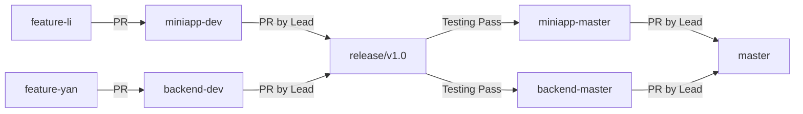

# Contributing to CNI Alumni Management System

First off, thank you for considering contributing to the CNI Alumni Management System! It's people like you that make this project a great tool for alumni management.

## 📋 Table of Contents

- [Code of Conduct](#code-of-conduct)
- [How Can I Contribute?](#how-can-i-contribute)
- [Development Workflow](#development-workflow)
- [Branch Strategy](#branch-strategy)
- [Development Setup](#development-setup)
- [Coding Standards](#coding-standards)
- [Commit Message Guidelines](#commit-message-guidelines)
- [Pull Request Process](#pull-request-process)
- [Testing Requirements](#testing-requirements)
- [License Agreement](#license-agreement)
- [Getting Help](#getting-help)

---

## 📜 Code of Conduct

This project and everyone participating in it is governed by our commitment to fostering an open and welcoming environment. We pledge to:

- Use welcoming and inclusive language
- Be respectful of differing viewpoints and experiences
- Gracefully accept constructive criticism
- Focus on what is best for the community
- Show empathy towards other community members

---

## 🤝 How Can I Contribute?

### Reporting Bugs

Before creating bug reports, please check existing issues to avoid duplicates. When you create a bug report, include as many details as possible:

- **Use a clear and descriptive title**
- **Describe the exact steps to reproduce the problem**
- **Provide specific examples** (code snippets, screenshots)
- **Describe the behavior you observed** and what you expected
- **Include your environment details** (OS, Node.js version, Java version, etc.)

### Suggesting Enhancements

Enhancement suggestions are tracked as GitHub issues. When creating an enhancement suggestion:

- **Use a clear and descriptive title**
- **Provide a detailed description** of the proposed functionality
- **Explain why this enhancement would be useful**
- **List any alternative solutions** you've considered

### Contributing Code

We actively welcome your pull requests! Follow the [Development Workflow](#development-workflow) and [Pull Request Process](#pull-request-process) sections below.

---

## 🔄 Development Workflow

### Understanding Our Monorepo

This project uses a **monorepo structure** with separate branches for frontend (Mini Program) and backend (Spring Boot):

```
5460-alumni/
├── apps/
│   ├── mini-app/          # WeChat Mini Program
│   └── server-java/       # Spring Boot Backend
```

---

## 🌿 Branch Strategy

We use a **structured branching model** to ensure code quality and stability:

### Main Branches

- **`master`** - Main integration branch (combines all stable code)
- **`miniapp-master`** - Stable Mini Program production branch
- **`backend-master`** - Stable Backend production branch

### Development Branches

- **`miniapp-dev`** - Mini Program development branch
- **`backend-dev`** - Backend development branch

### Feature Branches

- **`feature-{name}`** - Individual developer feature branches
  - Example: `feature-li`, `feature-yan`

### Release Branches

- **`release/v1.0`** - Version-specific release testing branch

### Workflow Diagram



### Branch Permissions

| From Branch | To Branch | Who Can Merge |
|------------|-----------|---------------|
| `feature-*` | `*-dev` | All contributors |
| `*-dev` | `release/*` | **Project Lead only** (@yannqing) |
| `release/*` | `*-master` | **Project Lead only** (@yannqing) |
| `*-master` | `master` | **Project Lead only** (@yannqing) |

---

## 🛠️ Development Setup

### Prerequisites

- **Node.js** >= 18.0.0
- **pnpm** >= 8.0.0
- **Java** 17
- **Maven** 3.8+
- **Docker** & **Docker Compose** (Optional)
- **WeChat DevTools** (for Mini Program development)

### Fork and Clone

1. **Fork** this repository to your GitHub account
2. **Clone** your fork locally:

```bash
git clone https://github.com/YOUR_USERNAME/5460-alumni.git
cd 5460-alumni
```

3. **Add upstream** remote:

```bash
git remote add upstream https://github.com/yannqing/5460-alumni.git
```

### Install Dependencies

```bash
# Install all dependencies using pnpm
pnpm install
```

### Start Development Environment

#### Option 1: Start Everything

```bash
pnpm dev
```

#### Option 2: Start Specific Projects

```bash
# Mini Program only
pnpm dev:mini

# Backend only
pnpm dev:java
```

#### Option 3: Start Infrastructure (Docker)

```bash
cd apps/server-java
docker-compose -f docker-compose-local.yml up -d
```

This will start:
- MySQL 8.3
- Redis
- Apache Kafka
- Elasticsearch 8.13.4

---

## 💻 Coding Standards

### General Principles

- Write clean, readable, and maintainable code
- Follow the existing code style in the project
- Add comments for complex logic
- Keep functions small and focused
- Use meaningful variable and function names

### Frontend (WeChat Mini Program)

**JavaScript/ES6+**

```javascript
// ✅ Good: Use descriptive names
const getUserProfile = async (userId) => {
  try {
    const response = await request.get(`/api/user/${userId}`);
    return response.data;
  } catch (error) {
    console.error('Failed to fetch user profile:', error);
    throw error;
  }
};

// ❌ Bad: Vague names and no error handling
const get = (id) => {
  return request.get(`/api/user/${id}`).data;
};
```

**File Naming**
- Use **camelCase** for JavaScript files: `userService.js`, `requestInterceptor.js`
- Use **kebab-case** for page directories: `user-profile/`, `alumni-list/`

**Component Structure**
```
pages/
├── user-profile/
│   ├── user-profile.js      # Logic
│   ├── user-profile.wxml    # Template
│   ├── user-profile.wxss    # Styles
│   └── user-profile.json    # Configuration
```

### Backend (Spring Boot / Java)

**Java Naming Conventions**

```java
// ✅ Good: Follow Java conventions
@Service
public class UserServiceImpl implements UserService {

    @Autowired
    private UserRepository userRepository;

    @Override
    public UserDTO getUserById(Long userId) {
        User user = userRepository.findById(userId)
            .orElseThrow(() -> new ResourceNotFoundException("User not found"));
        return UserConverter.toDTO(user);
    }
}

// ❌ Bad: Poor naming and structure
@Service
public class service {
    public Object get(Long id) {
        return repo.findById(id);
    }
}
```

**Package Structure**
```
com.cni.alumni/
├── controller/        # REST endpoints
├── service/           # Business logic
│   └── impl/          # Service implementations
├── repository/        # Data access layer
├── model/             # Entity models
├── dto/               # Data transfer objects
├── config/            # Configuration classes
└── util/              # Utility classes
```

**Annotation Order**
```java
@RestController
@RequestMapping("/api/v1/users")
@Slf4j
@RequiredArgsConstructor
public class UserController {
    // ...
}
```

### Code Formatting

- **Indentation**: 2 spaces for JavaScript, 4 spaces for Java
- **Line Length**: Maximum 120 characters
- **Braces**: Always use braces for if/for/while blocks

---

## 📝 Commit Message Guidelines

We follow the [Conventional Commits](https://www.conventionalcommits.org/) specification for clear and consistent commit history.

### Format

```
<type>(<scope>): <subject>

<body> (optional)

<footer> (optional)
```

### Types

- **feat**: New feature
- **fix**: Bug fix
- **docs**: Documentation changes
- **style**: Code style changes (formatting, no logic change)
- **refactor**: Code refactoring (no feature change or bug fix)
- **perf**: Performance improvements
- **test**: Adding or updating tests
- **chore**: Maintenance tasks (dependency updates, build config)
- **ci**: CI/CD pipeline changes

### Examples

```bash
# Feature
git commit -m "feat(user): add user profile editing functionality"

# Bug fix
git commit -m "fix(auth): resolve JWT token expiration issue"

# Documentation
git commit -m "docs(readme): update installation instructions"

# Refactor
git commit -m "refactor(service): extract common validation logic"

# Performance
git commit -m "perf(cache): implement Redis caching for user queries"
```

### Scope Examples

**Frontend**: `miniapp`, `ui`, `auth`, `chat`, `association`
**Backend**: `user`, `api`, `service`, `config`, `security`, `kafka`, `redis`

---

## 🔀 Pull Request Process

### 1. Create Feature Branch

**For Mini Program Development:**

```bash
# Update your local dev branch
git checkout miniapp-dev
git pull upstream miniapp-dev

# Create your feature branch
git checkout -b feature-{yourname}
```

**For Backend Development:**

```bash
# Update your local dev branch
git checkout backend-dev
git pull upstream backend-dev

# Create your feature branch
git checkout -b feature-{yourname}
```

### 2. Make Your Changes

- Write clean, well-documented code
- Follow coding standards above
- Keep commits atomic and focused
- Write meaningful commit messages

### 3. Test Your Changes

**Frontend Testing:**
```bash
# Open WeChat DevTools and test manually
# Ensure no console errors
# Test on real device if possible
```

**Backend Testing:**
```bash
# Run Maven build and tests
cd apps/server-java
mvn clean package

# Ensure build succeeds
# Fix any compilation errors
```

### 4. Push to Your Fork

```bash
git push origin feature-{yourname}
```

### 5. Open Pull Request

1. Go to your fork on GitHub
2. Click **"New Pull Request"**
3. **Base repository**: `yannqing/5460-alumni`
4. **Base branch**:
   - `miniapp-dev` (for Mini Program changes)
   - `backend-dev` (for Backend changes)
5. **Head repository**: `YOUR_USERNAME/5460-alumni`
6. **Compare branch**: `feature-{yourname}`

### 6. PR Title and Description

**PR Title Format:**
```
<type>(<scope>): <summary>
```

**Example:**
```
feat(user): add user profile editing functionality
```

**PR Description Template:**

```markdown
## 📋 Description
Brief description of what this PR does.

## 🎯 Type of Change
- [ ] Bug fix (non-breaking change which fixes an issue)
- [ ] New feature (non-breaking change which adds functionality)
- [ ] Breaking change (fix or feature that would cause existing functionality to not work as expected)
- [ ] Documentation update

## 🧪 Testing
Describe how you tested your changes:
- [ ] Manual testing on WeChat DevTools
- [ ] Backend unit tests passed (`mvn test`)
- [ ] Build succeeded (`mvn clean package`)

## 📸 Screenshots (if applicable)
Add screenshots to demonstrate UI changes.

## ✅ Checklist
- [ ] My code follows the project's coding standards
- [ ] I have performed a self-review of my code
- [ ] I have commented my code, particularly in hard-to-understand areas
- [ ] My changes generate no new warnings
- [ ] I have updated documentation if necessary
- [ ] I agree to the MIT License terms
```

### 7. Code Review

- **feature → dev**: All team members can review and approve
- **dev → release → master**: Only **@yannqing** (Project Lead) reviews and merges

### 8. Address Review Comments

If changes are requested:

```bash
# Make the requested changes
git add .
git commit -m "fix: address review comments"
git push origin feature-{yourname}
```

The PR will automatically update.

### 9. Merge

- Once approved, the PR will be merged by the authorized person
- Your feature branch can be deleted after merge

---

## 🧪 Testing Requirements

### Current State

⚠️ **Note**: Comprehensive testing requirements are being developed. Current requirements:

### Backend

**Mandatory:**
```bash
# Must pass Maven build
mvn clean package
```

This includes:
- Compilation checks
- Basic integration with Jenkins (automated deployment only)

**Recommended:**
```bash
# Run unit tests
mvn test

# Generate test coverage report
mvn jacoco:report
```

### Frontend

**Manual Testing Required:**
- Test all UI interactions in WeChat DevTools
- Verify no console errors
- Test API integrations
- Verify responsive layout
- Test on real device (recommended)

### Future Requirements

We plan to implement:
- [ ] Automated frontend testing
- [ ] Minimum test coverage requirements (70%+)
- [ ] GitHub Actions CI/CD pipeline
- [ ] E2E testing with Cypress/Playwright

---

## 📄 License Agreement

By contributing to this project, you agree that your contributions will be licensed under the **MIT License**.

This means:
- ✅ Your code can be used commercially
- ✅ Your code can be modified and distributed
- ✅ You retain copyright of your contributions
- ✅ You provide your contributions "as-is" without warranty

When you submit a Pull Request, you are agreeing to these terms.

---

## 🆘 Getting Help

### Communication Channels

We're here to help! Reach out through:

- **GitHub Issues**: [Create an issue](https://github.com/yannqing/5460-alumni/issues)
- **Email**: yannqing020803@gmail.com
- **WeChat**: Ask for WeChat group invitation via email
- **Telegram**: [@yan_qing02](https://t.me/yan_qing02)
- **X (Twitter)**: [@yan_qing02](https://x.com/yan_qing02)

### Before Asking

1. Check existing **Issues** for similar questions
2. Review the **README.md** for basic setup
3. Search the **codebase** for examples

### When Asking

Include:
- What you're trying to achieve
- What you've already tried
- Error messages (full stack trace)
- Environment details (OS, Node.js version, Java version)
- Screenshots if applicable

---

## 🎉 Thank You!

Thank you for taking the time to contribute! Every contribution, no matter how small, helps make this project better.

**Special Thanks** to all our contributors:

<a href="https://github.com/yannqing/5460-alumni/graphs/contributors">
  
</a>

---

<div align="center">

**Happy Coding!** 🚀

Built with ❤️ by the CNI Alumni Team

</div>
