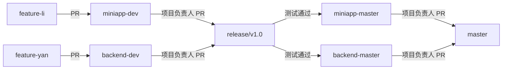

# 为 CNI 校友管理系统贡献代码

首先，感谢你考虑为 CNI 校友管理系统做出贡献！正是像你这样的人，让这个项目成为校友管理的优秀工具。

## 📋 目录

- [行为准则](#行为准则)
- [如何贡献](#如何贡献)
- [开发工作流](#开发工作流)
- [分支策略](#分支策略)
- [开发环境设置](#开发环境设置)
- [编码规范](#编码规范)
- [提交信息规范](#提交信息规范)
- [Pull Request 流程](#pull-request-流程)
- [测试要求](#测试要求)
- [许可证协议](#许可证协议)
- [获取帮助](#获取帮助)

---

## 📜 行为准则

本项目及其所有参与者都致力于营造一个开放和热情的环境。我们承诺：

- 使用欢迎和包容的语言
- 尊重不同的观点和经验
- 优雅地接受建设性批评
- 关注对社区最有利的事情
- 对其他社区成员表现出同理心

---

## 🤝 如何贡献

### 报告 Bug

在创建 bug 报告之前，请检查现有的 issue 以避免重复。创建 bug 报告时，请包含尽可能多的细节：

- **使用清晰且描述性的标题**
- **详细描述重现问题的确切步骤**
- **提供具体示例**（代码片段、截图）
- **描述你观察到的行为**以及你期望的行为
- **包含你的环境详细信息**（操作系统、Node.js 版本、Java 版本等）

### 提出功能建议

功能建议作为 GitHub Issues 进行跟踪。创建功能建议时：

- **使用清晰且描述性的标题**
- **提供所提议功能的详细描述**
- **解释为什么这个增强功能会有用**
- **列出你考虑过的任何替代方案**

### 贡献代码

我们非常欢迎你的 Pull Request！请遵循下面的[开发工作流](#开发工作流)和 [Pull Request 流程](#pull-request-流程)部分。

---

## 🔄 开发工作流

### 理解我们的 Monorepo

本项目使用 **monorepo 结构**，前端（小程序）和后端（Spring Boot）使用独立分支：

```
5460-alumni/
├── apps/
│   ├── mini-app/          # 微信小程序
│   └── server-java/       # Spring Boot 后端
```

---

## 🌿 分支策略

我们使用**结构化的分支模型**来确保代码质量和稳定性：

### 主分支

- **`master`** - 主集成分支（合并所有稳定代码）
- **`miniapp-master`** - 稳定的小程序生产分支
- **`backend-master`** - 稳定的后端生产分支

### 开发分支

- **`miniapp-dev`** - 小程序开发分支
- **`backend-dev`** - 后端开发分支

### 功能分支

- **`feature-{name}`** - 个人开发者的功能分支
  - 示例：`feature-li`、`feature-yan`

### 发布分支

- **`release/v1.0`** - 特定版本的发布测试分支

### 工作流程图



### 分支权限

| 源分支 | 目标分支 | 谁可以合并 |
|------------|-----------|---------------|
| `feature-*` | `*-dev` | 所有贡献者 |
| `*-dev` | `release/*` | **仅项目负责人** (@yannqing) |
| `release/*` | `*-master` | **仅项目负责人** (@yannqing) |
| `*-master` | `master` | **仅项目负责人** (@yannqing) |

---

## 🛠️ 开发环境设置

### 环境要求

- **Node.js** >= 18.0.0
- **pnpm** >= 8.0.0
- **Java** 17
- **Maven** 3.8+
- **Docker** & **Docker Compose**（可选）
- **微信开发者工具**（用于小程序开发）

### Fork 和 Clone

1. **Fork** 本仓库到你的 GitHub 账户
2. **Clone** 你的 fork 到本地：

```bash
git clone https://github.com/YOUR_USERNAME/5460-alumni.git
cd 5460-alumni
```

3. **添加上游远程仓库**：

```bash
git remote add upstream https://github.com/yannqing/5460-alumni.git
```

### 安装依赖

```bash
# 使用 pnpm 安装所有依赖
pnpm install
```

### 启动开发环境

#### 方式 1：启动所有服务

```bash
pnpm dev
```

#### 方式 2：启动特定项目

```bash
# 仅小程序
pnpm dev:mini

# 仅后端
pnpm dev:java
```

#### 方式 3：启动基础设施（Docker）

```bash
cd apps/server-java
docker-compose -f docker-compose-local.yml up -d
```

这将启动：
- MySQL 8.3
- Redis
- Apache Kafka
- Elasticsearch 8.13.4

---

## 💻 编码规范

### 通用原则

- 编写简洁、可读、可维护的代码
- 遵循项目中现有的代码风格
- 为复杂逻辑添加注释
- 保持函数小而专注
- 使用有意义的变量和函数名

### 前端（微信小程序）

**JavaScript/ES6+**

```javascript
// ✅ 好：使用描述性名称
const getUserProfile = async (userId) => {
  try {
    const response = await request.get(`/api/user/${userId}`);
    return response.data;
  } catch (error) {
    console.error('获取用户资料失败:', error);
    throw error;
  }
};

// ❌ 坏：模糊的名称且没有错误处理
const get = (id) => {
  return request.get(`/api/user/${id}`).data;
};
```

**文件命名**
- JavaScript 文件使用 **camelCase**：`userService.js`、`requestInterceptor.js`
- 页面目录使用 **kebab-case**：`user-profile/`、`alumni-list/`

**组件结构**
```
pages/
├── user-profile/
│   ├── user-profile.js      # 逻辑
│   ├── user-profile.wxml    # 模板
│   ├── user-profile.wxss    # 样式
│   └── user-profile.json    # 配置
```

### 后端（Spring Boot / Java）

**Java 命名规范**

```java
// ✅ 好：遵循 Java 规范
@Service
public class UserServiceImpl implements UserService {

    @Autowired
    private UserRepository userRepository;

    @Override
    public UserDTO getUserById(Long userId) {
        User user = userRepository.findById(userId)
            .orElseThrow(() -> new ResourceNotFoundException("用户未找到"));
        return UserConverter.toDTO(user);
    }
}

// ❌ 坏：命名和结构不佳
@Service
public class service {
    public Object get(Long id) {
        return repo.findById(id);
    }
}
```

**包结构**
```
com.cni.alumni/
├── controller/        # REST 端点
├── service/           # 业务逻辑
│   └── impl/          # 服务实现
├── repository/        # 数据访问层
├── model/             # 实体模型
├── dto/               # 数据传输对象
├── config/            # 配置类
└── util/              # 工具类
```

**注解顺序**
```java
@RestController
@RequestMapping("/api/v1/users")
@Slf4j
@RequiredArgsConstructor
public class UserController {
    // ...
}
```

### 代码格式化

- **缩进**：JavaScript 使用 2 个空格，Java 使用 4 个空格
- **行长度**：最大 120 字符
- **大括号**：if/for/while 块始终使用大括号

---

## 📝 提交信息规范

我们遵循 [Conventional Commits](https://www.conventionalcommits.org/) 规范，以确保清晰一致的提交历史。

### 格式

```
<type>(<scope>): <subject>

<body>（可选）

<footer>（可选）
```

### 类型

- **feat**: 新功能
- **fix**: Bug 修复
- **docs**: 文档变更
- **style**: 代码样式变更（格式化，不改变逻辑）
- **refactor**: 代码重构（既不是新功能也不是 bug 修复）
- **perf**: 性能改进
- **test**: 添加或更新测试
- **chore**: 维护任务（依赖更新、构建配置）
- **ci**: CI/CD 流水线变更

### 示例

```bash
# 新功能
git commit -m "feat(user): 添加用户资料编辑功能"

# Bug 修复
git commit -m "fix(auth): 解决 JWT token 过期问题"

# 文档
git commit -m "docs(readme): 更新安装说明"

# 重构
git commit -m "refactor(service): 提取通用验证逻辑"

# 性能
git commit -m "perf(cache): 为用户查询实现 Redis 缓存"
```

### Scope 示例

**前端**：`miniapp`、`ui`、`auth`、`chat`、`association`
**后端**：`user`、`api`、`service`、`config`、`security`、`kafka`、`redis`

---

## 🔀 Pull Request 流程

### 1. 创建功能分支

**小程序开发：**

```bash
# 更新本地 dev 分支
git checkout miniapp-dev
git pull upstream miniapp-dev

# 创建你的功能分支
git checkout -b feature-{yourname}
```

**后端开发：**

```bash
# 更新本地 dev 分支
git checkout backend-dev
git pull upstream backend-dev

# 创建你的功能分支
git checkout -b feature-{yourname}
```

### 2. 进行修改

- 编写简洁、有良好文档的代码
- 遵循上述编码规范
- 保持提交原子化和专注
- 编写有意义的提交信息

### 3. 测试你的修改

**前端测试：**
```bash
# 在微信开发者工具中打开并手动测试
# 确保没有控制台错误
# 如果可能，在真机上测试
```

**后端测试：**
```bash
# 运行 Maven 构建和测试
cd apps/server-java
mvn clean package

# 确保构建成功
# 修复任何编译错误
```

### 4. 推送到你的 Fork

```bash
git push origin feature-{yourname}
```

### 5. 打开 Pull Request

1. 访问你在 GitHub 上的 fork
2. 点击 **"New Pull Request"**
3. **基础仓库**：`yannqing/5460-alumni`
4. **基础分支**：
   - `miniapp-dev`（用于小程序修改）
   - `backend-dev`（用于后端修改）
5. **头部仓库**：`YOUR_USERNAME/5460-alumni`
6. **比较分支**：`feature-{yourname}`

### 6. PR 标题和描述

**PR 标题格式：**
```
<type>(<scope>): <summary>
```

**示例：**
```
feat(user): 添加用户资料编辑功能
```

**PR 描述模板：**

```markdown
## 📋 描述
简要描述此 PR 的作用。

## 🎯 变更类型
- [ ] Bug 修复（不破坏现有功能的非破坏性变更）
- [ ] 新功能（添加功能的非破坏性变更）
- [ ] 破坏性变更（会导致现有功能无法正常工作的修复或功能）
- [ ] 文档更新

## 🧪 测试
描述你如何测试你的修改：
- [ ] 在微信开发者工具中手动测试
- [ ] 后端单元测试通过（`mvn test`）
- [ ] 构建成功（`mvn clean package`）

## 📸 截图（如适用）
添加截图以演示 UI 变更。

## ✅ 检查清单
- [ ] 我的代码遵循项目的编码规范
- [ ] 我已对我的代码进行了自我审查
- [ ] 我已为我的代码添加了注释，特别是在难以理解的地方
- [ ] 我的修改没有产生新的警告
- [ ] 我已在必要时更新了文档
- [ ] 我同意 MIT 许可证条款
```

### 7. 代码审查

- **feature → dev**：所有团队成员都可以审查和批准
- **dev → release → master**：仅 **@yannqing**（项目负责人）审查和合并

### 8. 处理审查意见

如果请求修改：

```bash
# 进行请求的修改
git add .
git commit -m "fix: 处理审查意见"
git push origin feature-{yourname}
```

PR 将自动更新。

### 9. 合并

- 一旦批准，PR 将由授权人员合并
- 合并后可以删除你的功能分支

---

## 🧪 测试要求

### 当前状态

⚠️ **注意**：全面的测试要求正在制定中。当前要求：

### 后端

**强制：**
```bash
# 必须通过 Maven 构建
mvn clean package
```

这包括：
- 编译检查
- 与 Jenkins 的基本集成（仅自动化部署）

**推荐：**
```bash
# 运行单元测试
mvn test

# 生成测试覆盖率报告
mvn jacoco:report
```

### 前端

**手动测试要求：**
- 在微信开发者工具中测试所有 UI 交互
- 验证没有控制台错误
- 测试 API 集成
- 验证响应式布局
- 在真机上测试（推荐）

### 未来要求

我们计划实施：
- [ ] 自动化前端测试
- [ ] 最低测试覆盖率要求（70%+）
- [ ] GitHub Actions CI/CD 流水线
- [ ] 使用 Cypress/Playwright 进行 E2E 测试

---

## 📄 许可证协议

通过为本项目做出贡献，你同意你的贡献将在 **MIT 许可证**下授权。

这意味着：
- ✅ 你的代码可以用于商业用途
- ✅ 你的代码可以被修改和分发
- ✅ 你保留对你的贡献的版权
- ✅ 你"按原样"提供你的贡献，不提供任何保证

当你提交 Pull Request 时，你就同意了这些条款。

---

## 🆘 获取帮助

### 沟通渠道

我们随时为你提供帮助！通过以下方式联系：

- **GitHub Issues**：[创建 issue](https://github.com/yannqing/5460-alumni/issues)
- **邮箱**：yannqing020803@gmail.com
- **微信**：通过邮箱请求加入微信群
- **Telegram**：[@yan_qing02](https://t.me/yan_qing02)
- **X (Twitter)**：[@yan_qing02](https://x.com/yan_qing02)

### 提问前

1. 检查现有的 **Issues** 以查找类似问题
2. 查看 **README.md** 了解基本设置
3. 在**代码库**中搜索示例

### 提问时

包含：
- 你想要实现的目标
- 你已经尝试过的内容
- 错误信息（完整的堆栈跟踪）
- 环境详细信息（操作系统、Node.js 版本、Java 版本）
- 截图（如适用）

---

## 🎉 感谢你！

感谢你花时间做出贡献！每一个贡献，无论大小，都有助于使这个项目变得更好。

**特别感谢**所有贡献者：

<a href="https://github.com/yannqing/5460-alumni/graphs/contributors">
  
</a>

---

<div align="center">

**祝编码愉快！** 🚀

由 CNI 校友团队用 ❤️ 构建

</div>
