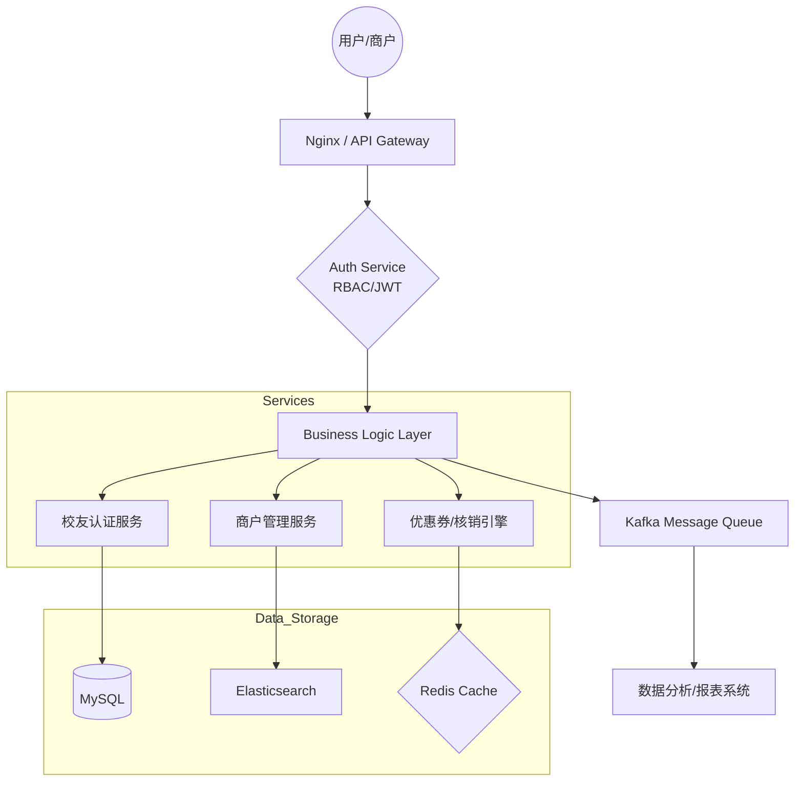

彦青，这份需求文档非常扎实，业务闭环（注册-认证-找店-领券-核销）清晰，且具备极强的商业落地潜力。作为一名全栈开发者，你的技术架构图（Mermaid）已经非常专业。

为了让这份 README 在 GitHub 上显得“贵”且具备“大厂架构师”的视觉冲击力，我为你设计了一个**顶尖的 README 模板**。它不仅是代码说明，更是一份**产品白皮书**。

---

# 🚀 5460 Alumni Network (China Alumni Platform)

> **“连接校友价值，重塑商业链接。”** —— 5460项目致敬中国第一代校友录，基于现代 AI 与微服务架构重新定义垂直社交与本地生活服务。

## 📖 项目愿景

5460 项目是一个深度链接“校友资源”与“本地商圈”的 O2O 闭环平台。它不仅是一个官方认证的校友社交平台，更是一个精准的校友经济生态系统，实现从身份认证到精准消费核销的完整业务流。

### 🌟 核心价值主张

* **官方背书**：100+ 校友会官方认证，确保用户身份真实性。
* **私域流量**：精准的校友画像，为商户提供极高转化率的私域流量池。
* **AI 驱动**：利用 AI 智能推荐、自动化审核流程提升平台运营人效。

---

## 🛠 技术栈架构 (Tech Stack)

项目采用**前后端分离**、**微服务思想**构建，强调高并发下的数据一致性与安全性。

### 后端 (The Core)

* **核心框架**: Java 17 / Spring Boot 3.x / Spring Security
* **中间件**:
* **Kafka**: 异步处理领券与核销高峰流量。
* **Redis**: 实现高频地理位置（GeoHash）检索与优惠券秒杀库存控制。
* **Elasticsearch**: 驱动“找人/找店”的复杂模糊搜索与个性化推荐。


* **数据层**: MySQL 8.0 (关系型核心) + PostgreSQL (地理空间数据分析)

### 前端 (The Interface)

* **用户端**: 微信小程序 (原生/Uni-app) —— 极速触达。
* **管理后台**: Next.js 14 + Tailwind CSS + Lucide Icons —— 响应式极致体验。
* **ORM/Auth**: Drizzle ORM + Better Auth (Next.js 生态)。

---

## 🏗 系统架构设计 (Architecture)

### 1. 全链路业务架构

项目通过多级权限体系（校友总会 -> 地方校处会 -> 学校校友会）构建了严密的社会化组织网络。

### 2. 技术拓扑图



---

## 🔥 核心功能亮点 (Key Features)

### 🛡️ 极严身份认证体系

* **双重校验**：实名认证（人脸识别接口）+ 在校经历深度验证。
* **多维身份**：支持多母校、多校友会身份切换，完美解决“本硕博”不同圈子的社交需求。

### 🏷️ 智能优惠券与核销引擎

* **精准触达**：基于 LBS（地理位置）的“同学店”推荐，支持“校友老板”专项优惠。
* **高性能核销**：针对高峰期设计的并发控制机制，防止超发与重复核销。

### 🔍 隐私级找人系统

* **默认隐藏**：极致尊重校友隐私，支持精确查找（五要素匹配）与校友会内模糊匹配。
* **互动留痕**：基于消费记录与活动记录的社交发现，让“遇见校友”变得自然。

---

## 📈 项目管理与效能 (Engineering Excellence)

本项目采用 **AI-Native 开发流**，通过 `Cursor` 与 `Claude Code` 深度辅助，实现了极高的人效比。

* **CI/CD**: 基于 Jenkins 的自动化流水线，支持代码推送即部署（Push-to-Deploy）。
* **协作规范**: 严格执行 Git Flow 流程，所有代码经过严谨的 PR (Pull Request) 审核与 AI 静态扫描。
* **文档化**: 坚持“文档先行”原则，拥有完善的接口文档与业务流程图。

---

## 🚀 快速启动 (Quick Start)

```bash
# 克隆仓库
git clone https://github.com/your-username/5460-alumni-platform.git

# 安装依赖 (以管理端为例)
cd apps/admin-panel
pnpm install

# 启动后端 (Maven)
cd server/java-backend
mvn spring-boot:run

```

---

## 👥 贡献者与团队 (The Team)

* **Lead Architect**: [Yanqing]() (Full Stack & System Architecture)
* **Frontend Contributors**: 2 Interns (Supervised under AI-driven workflow)

---

## 📅 2026 Roadmap

* [ ] AI Agent 自动审核校友资质
* [ ] 接入 Web3 证书存储校友成就
* [ ] 推出“校友企业”融资对接模块

---

© 2026 青杉彦智能科技有限公司 (Qing-Shan-Yan AI Tech). 版权所有。

