# 🎓 CNI Alumni Management System

<div align="center">

**A Full-Stack Alumni Management Platform Built with Modern Architecture**

[](https://opensource.org/licenses/MIT)
[](https://pnpm.io/)
[](https://turbo.build/repo)
[](https://spring.io/projects/spring-boot)
[](https://openjdk.org/)

[English](README.md) | [简体中文](README_CN.md)

</div>

---

## 📖 Overview

The **CNI Alumni Management System** is an enterprise-grade full-stack platform designed for alumni association management, featuring a WeChat Mini Program frontend and a Spring Boot microservices backend. This project demonstrates modern software architecture patterns, monorepo management, and scalable system design.

### 🎯 Key Highlights

- 🏗️ **Monorepo Architecture** - Unified codebase management with pnpm workspaces and Turborepo
- 🔄 **Event-Driven Design** - Asynchronous processing with Apache Kafka
- 🚀 **High-Performance Caching** - Multi-layer caching strategy (Redis + Caffeine)
- 🔍 **Full-Text Search** - Elasticsearch integration for advanced search capabilities
- 🔐 **Secure Authentication** - JWT-based authentication with signature verification
- 📱 **Native Mini Program** - WeChat native development (no frameworks) for optimal performance
- 🐳 **Containerized Deployment** - Docker & Docker Compose for consistent environments
- 📊 **Real-time Communication** - WebSocket support for instant messaging

---

## 📸 Screenshots

> **Note**: This section showcases the WeChat Mini Program interface and key features.

<div align="center">

### 📱 Main Features Overview

<table>
  <tr>
    <td align="center" width="50%">
      
      <br>
      <b>🏠 Home Page</b>
      <br>
      <sub>User dashboard with quick access</sub>
    </td>
    <td align="center" width="50%">
      
      <br>
      <b>🎓 Alumni Association</b>
      <br>
      <sub>Browse and join associations</sub>
    </td>
  </tr>
  <tr>
    <td align="center" width="50%">
      
      <br>
      <b>📍 Local Platform</b>
      <br>
      <sub>Regional activity discovery</sub>
    </td>
    <td align="center" width="50%">
      
      <br>
      <b>🔍 Search Function</b>
      <br>
      <sub>Elasticsearch-powered full-text search</sub>
    </td>
  </tr>
  <tr>
    <td align="center" width="50%">
      
      <br>
      <b>💬 Real-time Chat</b>
      <br>
      <sub>WebSocket-powered messaging</sub>
    </td>
    <td align="center" width="50%">
      
      <br>
      <b>👤 User Profile</b>
      <br>
      <sub>Personal information management</sub>
    </td>
  </tr>
</table>

</div>

---

## 🏛️ System Architecture

### High-Level Architecture Diagram


### Data Flow Architecture

```mermaid
sequenceDiagram
    participant User as 👤 User
    participant MiniApp as 📱 Mini Program
    participant Gateway as 🚪 API Gateway
    participant Auth as 🔐 Auth Service
    participant Cache as 💾 Redis Cache
    participant Service as ⚙️ Business Service
    participant MQ as 📨 Kafka
    participant DB as 🗄️ MySQL
    participant Search as 🔍 Elasticsearch

    User->>MiniApp: Open App
    MiniApp->>Gateway: Request with Token
    Gateway->>Auth: Verify JWT + Signature
    Auth-->>Gateway: Authorized

    Gateway->>Cache: Check Cache
    alt Cache Hit
        Cache-->>Gateway: Return Cached Data
        Gateway-->>MiniApp: Response
    else Cache Miss
        Gateway->>Service: Process Request
        Service->>DB: Query Data
        DB-->>Service: Result Set
        Service->>Cache: Update Cache
        Service-->>Gateway: Business Data
        Gateway-->>MiniApp: Response
    end

    alt Async Operation
        Service->>MQ: Publish Event
        MQ->>Service: Consume Event
        Service->>Search: Index Data
        Service->>DB: Update State
    end

    MiniApp-->>User: Display Result
```



### Technology Stack Overview


---

## 🗂️ Monorepo Structure

```
5460-alumni/
├── apps/
│   ├── mini-app/                 # WeChat Mini Program (Frontend)
│   │   ├── api/                  # API Client Layer
│   │   ├── pages/                # Page Components (28 modules)
│   │   ├── components/           # Reusable UI Components
│   │   ├── utils/                # Utility Functions
│   │   │   ├── request.js        # HTTP Client with Interceptors
│   │   │   ├── signature.js      # API Signature Verification
│   │   │   ├── socketManager.js  # WebSocket Manager
│   │   │   └── auth.js           # Authentication Logic
│   │   ├── assets/               # Static Resources
│   │   └── custom-tab-bar/       # Custom Navigation Bar
│   │
│   └── server-java/              # Spring Boot Backend
│       ├── alumni-main/          # Main Application Entry
│       ├── alumni-api/           # API Interface Definitions
│       │   ├── user-api/         # User Service API
│       │   ├── association-api/  # Association Service API
│       │   └── system-api/       # System Service API
│       ├── alumni-service/       # Business Logic Implementation
│       │   ├── user-service/
│       │   ├── association-service/
│       │   └── system-service/
│       ├── alumni-web/           # Web Controllers
│       ├── alumni-common/        # Common Utilities & Models
│       ├── alumni-config/        # Configuration Management
│       ├── alumni-auth/          # Authentication & Authorization
│       ├── alumni-aop/           # Aspect-Oriented Programming
│       ├── alumni-redis/         # Redis Integration
│       ├── alumni-kafka/         # Kafka Integration
│       └── alumni-search/        # Elasticsearch Integration
│
├── packages/                     # Shared Packages (Future)
│   └── shared-utils/             # Cross-Project Utilities
│
├── .github/
│   └── workflows/                # CI/CD Pipelines
│
├── docker-compose.yml            # Local Development Environment
├── turbo.json                    # Turborepo Configuration
├── pnpm-workspace.yaml           # pnpm Workspace Configuration
└── package.json                  # Root Package Configuration
```

---

## 🚀 Quick Start

### Prerequisites

- **Node.js** >= 18.0.0
- **pnpm** >= 8.0.0
- **Java** 17
- **Maven** 3.8+
- **Docker** & **Docker Compose** (Optional, for local services)
- **WeChat DevTools** (for Mini Program development)

> 💡 **Important Note**: Please ensure you don't commit `node_modules` or other build artifacts. A comprehensive `.gitignore` is provided in the root directory to prevent accidental commits.

### Installation

```bash
# Clone the repository
git clone https://github.com/yannqing/5460-alumni.git
cd 5460-alumni

# Install dependencies using pnpm
pnpm install
```

### Development

#### Start All Services

```bash
# Start both frontend and backend in parallel
pnpm dev
```

#### Start Individual Services

```bash
# Start Mini Program only
pnpm dev:mini

# Start Spring Boot backend only
pnpm dev:java
```

#### Start Infrastructure Services (Docker)

```bash
# Navigate to backend directory
cd apps/server-java

# Start MySQL, Redis, Kafka, Elasticsearch
docker-compose -f docker-compose-local.yml up -d
```

### Build

```bash
# Build all projects
pnpm build

# Build specific project
pnpm build:mini
pnpm build:java
```

### Testing

```bash
# Run all tests
pnpm test

# Run tests in watch mode
pnpm test:watch
```

---

## 🔧 Configuration

### Environment Variables

Create a `.env` file in the root directory:

```env
# Database Configuration (Required)
DB_HOST=localhost
DB_PORT=3306
DB_NAME=cni_alumni
DB_USERNAME=your_username
DB_PASSWORD=your_password

# Redis Configuration (Required)
REDIS_HOST=localhost
REDIS_PORT=6379
REDIS_PASSWORD=

# Kafka Configuration (Optional - can disable in Spring Profile if not needed)
KAFKA_BOOTSTRAP_SERVERS=localhost:9092

# Elasticsearch Configuration (Optional - can disable in Spring Profile if not needed)
ES_HOST=localhost
ES_PORT=9200

# WeChat Configuration (Required for Mini Program)
WECHAT_APPID=your_appid
WECHAT_SECRET=your_secret

# QQ Map API (Required for location features)
QQMAP_KEY=your_map_key
```

> 💡 **Quick Start Tip**: If you don't have Elasticsearch or Kafka set up locally, you can temporarily disable them by commenting out the corresponding Spring Boot auto-configuration in `application.yaml`. The core features (User, Association management) will still work with just MySQL and Redis.

### Backend Configuration

Edit `apps/server-java/alumni-main/src/main/resources/application.yaml`:

```yaml
spring:
  profiles:
    active: local  # Options: local, test, prod
```

---

## 📊 Core Features

### 🔐 Authentication & Authorization

- JWT-based stateless authentication
- API signature verification (timestamp + nonce)
- Role-based access control (RBAC)
- Automatic token refresh mechanism

### 👥 User Management

- WeChat silent login integration
- User profile management
- Alumni association membership
- Enterprise affiliation

### 🎓 Association Management

- Create and manage alumni associations
- Member approval workflow
- Organization structure hierarchy
- Activity planning and participation

### 💼 Enterprise Directory

- Enterprise registration and verification
- Alumni-owned business directory
- Job postings and career opportunities
- Business networking

### 📅 Activity Management

- Event creation and publishing
- Registration and attendance tracking
- Real-time notifications
- Photo gallery and sharing

### 💬 Messaging System

- Real-time chat with WebSocket
- Group conversations
- Message notifications
- File sharing (images, documents, audio)

### 🔍 Advanced Search

- Full-text search powered by Elasticsearch
- Fuzzy matching and relevance scoring
- Multi-field aggregation
- Search result highlighting

---

## 🏗️ Architecture Highlights

### Layered Architecture

```
┌─────────────────────────────────────┐
│      Presentation Layer             │  Controllers, DTOs, Validation
├─────────────────────────────────────┤
│      Business Logic Layer           │  Services, Domain Models
├─────────────────────────────────────┤
│      Data Access Layer              │  Repositories, ORM
├─────────────────────────────────────┤
│      Infrastructure Layer           │  Cache, MQ, Search, Storage
└─────────────────────────────────────┘
```

### Design Patterns Used

- **Repository Pattern** - Data access abstraction
- **Service Layer Pattern** - Business logic encapsulation
- **DTO Pattern** - Data transfer optimization
- **Strategy Pattern** - Payment and notification strategies
- **Observer Pattern** - Event-driven messaging with Kafka
- **Singleton Pattern** - Configuration management
- **Factory Pattern** - Service creation

### Caching Strategy

```
┌─────────────┐
│ Request     │
└──────┬──────┘
       │
       ▼
┌─────────────────────┐
│ L1: Caffeine Cache  │  (Local, In-Memory)
│ TTL: 5 minutes      │
└──────┬──────────────┘
       │ Cache Miss
       ▼
┌─────────────────────┐
│ L2: Redis Cache     │  (Distributed)
│ TTL: 1 hour         │
└──────┬──────────────┘
       │ Cache Miss
       ▼
┌─────────────────────┐
│ MySQL Database      │  (Persistent)
└─────────────────────┘
```

### Event-Driven Architecture


---

## 🛠️ Technology Deep Dive

### Frontend Architecture

**WeChat Mini Program Native Development**

- **Why Native?** Maximum performance, official API support, smaller package size
- **State Management** - Local storage + Event bus pattern
- **Network Layer** - Centralized request interceptor with retry logic
- **Component Reusability** - Custom components for UI consistency

**Key Technologies:**

- **API Signature** - Prevents replay attacks and tampering
- **WebSocket** - Real-time messaging with auto-reconnect
- **Image Optimization** - Lazy loading and compression
- **Request Deduplication** - Prevents concurrent duplicate requests

### Backend Architecture

**Spring Boot Microservices Design**

- **Multi-Module Maven** - Clear separation of concerns
- **Spring Security** - JWT authentication with custom filters
- **MyBatis Plus** - Enhanced ORM with auto-fill and pagination
- **Druid** - Connection pooling with SQL monitoring

**Key Technologies:**

- **Distributed Transactions** - Eventual consistency with Kafka
  - **Message Idempotency**: Each Kafka message includes a unique `messageId` to prevent duplicate processing
  - **Eventual Consistency**: Order creation → Inventory reduction → Notification sending are processed asynchronously
  - **Compensation Mechanism**: Failed messages are retried with exponential backoff, and manual compensation is triggered after max retries
  - **Data Consistency**: Using Saga pattern for distributed transaction coordination
- **API Idempotency** - Token-based idempotent design
- **Rate Limiting** - Redis + Lua script for distributed rate limiting
- **Async Processing** - @Async annotation with custom thread pool

### Database Design

**MySQL Schema Highlights:**

- **Logical Deletion** - `is_delete` flag for soft deletes
- **Optimistic Locking** - Version field for concurrent updates
- **Audit Fields** - `created_time`, `updated_time`, `creator`, `updater`
- **Index Optimization** - Composite indexes for common queries

**Sample Entity:**

```java
@Data
@TableName("user")
public class User {
    @TableId(type = IdType.AUTO)
    private Long id;

    private String username;
    private String nickname;
    private String avatar;

    @TableField(fill = FieldFill.INSERT)
    private LocalDateTime createdTime;

    @TableField(fill = FieldFill.INSERT_UPDATE)
    private LocalDateTime updatedTime;

    @Version
    private Integer version;

    @TableLogic
    private Integer isDelete;
}
```

### Search Architecture

**Elasticsearch Integration:**

- **Index Design** - Separate indices for users, activities, enterprises
- **Mapping Configuration** - IK Analyzer for Chinese text segmentation
- **Search Features** - Fuzzy search, phrase matching, boosting
- **Aggregation** - Faceted search and statistics

---

## 📦 Deployment

### Docker Deployment

```bash
# Build Docker image
cd apps/server-java
docker build -t cni-alumni:latest .

# Run container
docker run -d \
  -p 8080:8080 \
  -e SPRING_PROFILES_ACTIVE=prod \
  -e DB_HOST=your-db-host \
  -e DB_PASSWORD=your-password \
  --name cni-alumni \
  cni-alumni:latest
```

### Docker Compose Deployment

```bash
# Production deployment
docker-compose up -d
```

### Environment-Specific Profiles

```yaml
# application.yaml
spring:
  profiles:
    active: ${SPRING_PROFILES_ACTIVE:local}

---
# application-local.yaml (Development)
spring:
  config:
    activate:
      on-profile: local

---
# application-prod.yaml (Production)
spring:
  config:
    activate:
      on-profile: prod
```

---

## 👥 Team & Collaboration

### Project Structure

- **Project Lead** - Overall architecture and project management
- **Frontend Team** - WeChat Mini Program development
- **Backend Team** - Spring Boot microservices
- **DevOps Team** - CI/CD and infrastructure

### Contributors

<a href="https://github.com/yannqing/5460-alumni/graphs/contributors">
  
</a>

**Core Team Members:**
- **yannqing** - Project Lead & Full-Stack Architect
  - 🏗️ Overall architecture design and system planning
  - 💻 Backend development with Spring Boot microservices
  - 🚀 DevOps & Infrastructure automation
  - ✅ Automated Metrics: Real-time project contribution tracking via GitHub Actions
  - ✅ CI/CD Pipeline: Automated testing and deployment workflows
  - ✅ Infrastructure as Code: Docker & Docker Compose orchestration
- **cheny** - Frontend Development
  - 📱 WeChat Mini Program development
  - 🎨 UI/UX implementation
- **lili** - Frontend Development
  - 📱 WeChat Mini Program development
  - 🔧 Component architecture

---

## 📈 Performance Optimization

### Backend Optimizations

- **Connection Pooling** - Druid with optimized pool size
- **SQL Optimization** - Index tuning and query optimization
- **Cache Warming** - Pre-load frequently accessed data
- **Async Processing** - Non-blocking I/O for heavy operations
- **Batch Operations** - Batch insert/update for bulk data

### Frontend Optimizations

- **Code Splitting** - Subpackage loading for large apps
- **Image Optimization** - WebP format with fallback
- **Request Merging** - Combine multiple API calls
- **Local Caching** - Storage API for offline capability
- **Lazy Loading** - Load components on demand

---

## 🧪 Testing Strategy

### Backend Testing

```bash
# Unit Tests
mvn test

# Integration Tests
mvn verify

# Test Coverage Report
mvn jacoco:report
```

**Coverage Goals:**
- Unit Tests: >70%
- Integration Tests: >50%
- Critical Business Logic: >90%

### Frontend Testing

```bash
# Unit Tests (Future)
pnpm test:mini

# E2E Tests (Future)
pnpm test:e2e
```

---

## 📚 API Documentation

### Swagger UI

Access API documentation at: `http://localhost:8080/doc.html`

**Knife4j Features:**
- Interactive API testing
- Request/response examples
- Model schema visualization
- Authorization support

### Sample API Endpoint

```http
POST /api/v1/user/login
Content-Type: application/json

{
  "code": "WeChat login code",
  "timestamp": 1234567890,
  "signature": "calculated_signature"
}
```

**Response:**

```json
{
  "code": 200,
  "message": "Success",
  "data": {
    "token": "eyJhbGciOiJIUzI1NiIsInR5cCI6IkpXVCJ9...",
    "userInfo": {
      "id": 1,
      "username": "alumni001",
      "nickname": "John Doe",
      "avatar": "https://..."
    }
  }
}
```

---

## 🔒 Security Best Practices

### Implemented Security Measures

- ✅ **JWT Authentication** - Stateless token-based auth
- ✅ **API Signature Verification** - Prevent replay attacks
- ✅ **SQL Injection Prevention** - MyBatis parameterized queries
- ✅ **XSS Protection** - Input sanitization and output encoding
- ✅ **HTTPS Only** - Encrypted communication
- ✅ **CORS Configuration** - Whitelist-based origin control
- ✅ **Rate Limiting** - Prevent brute force attacks
- ✅ **Sensitive Data Encryption** - AES encryption for PII

### Security Checklist

- [ ] Regular dependency updates
- [ ] Security audit logs
- [ ] Penetration testing
- [ ] OWASP Top 10 compliance
- [ ] Data backup and recovery plan

---

## 🔐 Environment Setup

> **Security Notice**: This repository has been sanitized to remove all sensitive information from the git history. All credentials, API keys, and environment-specific configurations have been replaced with environment variable placeholders.

### Before You Begin

1. **Copy configuration template files:**
   ```bash
   # For Mini Program
   cp apps/mini-app/project.config.json.example apps/mini-app/project.config.json
   cp apps/mini-app/utils/config.js.example apps/mini-app/utils/config.js
   ```

2. **Fill in your own credentials in the copied files:**
   - `project.config.json`: WeChat Mini Program AppID
   - `config.js`: API domain, Cloud Environment ID, etc.

### Configuration Variables (in config.js)

| Variable | Description | Where to Get |
|----------|-------------|--------------|
| `API_DOMAIN` | Backend API Domain | Your deployed server domain |
| `CLOUD_ENV_ID` | Cloud Environment ID | WeChat Cloud Hosting Console |
| `CLOUD_PUBLIC_DOMAIN` | Cloud Public URL | WeChat Cloud Hosting Console |

### Important Notes

- **Never commit** `project.config.json`, `config.js`, or any file containing real credentials
- All sensitive files are already listed in `.gitignore`
- For team collaboration, share credentials through secure channels (not git)
- Rotate credentials immediately if accidentally exposed

---

## 📝 Contributing

We welcome contributions! Please see [CONTRIBUTING.md](CONTRIBUTING.md) for details.

### Development Workflow

1. **Fork** the repository
2. **Create** a feature branch (`git checkout -b feature/amazing-feature`)
3. **Commit** your changes (`git commit -m 'feat: add amazing feature'`)
4. **Push** to the branch (`git push origin feature/amazing-feature`)
5. **Open** a Pull Request

### Commit Message Convention

Follow [Conventional Commits](https://www.conventionalcommits.org/):

```
feat: add user profile page
fix: resolve token expiration issue
docs: update API documentation
style: format code with prettier
refactor: restructure service layer
test: add unit tests for auth service
chore: update dependencies
```

---

## 📄 License

This project is licensed under the MIT License - see the [LICENSE](LICENSE) file for details.

---

## 🙏 Acknowledgments

- [Spring Boot](https://spring.io/projects/spring-boot) - Backend framework
- [MyBatis Plus](https://baomidou.com/) - Enhanced MyBatis framework
- [Turborepo](https://turbo.build/repo) - Monorepo build system
- [WeChat Open Platform](https://developers.weixin.qq.com/miniprogram/dev/framework/) - Mini Program development

---

## 📞 Contact

- **Project Lead** - [@yannqing](https://github.com/yannqing)
- **X (Twitter)** - [@yan_qing02](https://x.com/yan_qing02)
- **Email** - yannqing020803@gmail.com
- **Project Link** - [https://github.com/yannqing/5460-alumni](https://github.com/yannqing/5460-alumni)

---

## 🗺️ Roadmap

### Phase 1 - Foundation (Completed ✅)
- [x] Monorepo setup with pnpm + Turborepo
- [x] WeChat Mini Program authentication
- [x] Spring Boot backend foundation
- [x] Database design and implementation
- [x] Redis caching layer
- [x] Kafka message queue integration

### Phase 2 - Core Features (In Progress 🚧)
- [x] User management
- [x] Association management
- [x] Activity management
- [ ] Payment integration
- [ ] Advanced search with Elasticsearch

### Phase 3 - Enhancement (Planned 📋)
- [ ] AI-powered recommendations
- [ ] Data analytics dashboard
- [ ] Mobile app (React Native)
- [ ] Internationalization (i18n)
- [ ] Microservices decomposition

### Phase 4 - Scale (Future 🚀)
- [ ] Kubernetes deployment
- [ ] Service mesh (Istio)
- [ ] Distributed tracing (Zipkin)
- [ ] Multi-region deployment
- [ ] 99.99% SLA

---

<div align="center">

**Built with ❤️ by the CNI Alumni Team**

⭐ Star this repo if you find it helpful!

</div>
