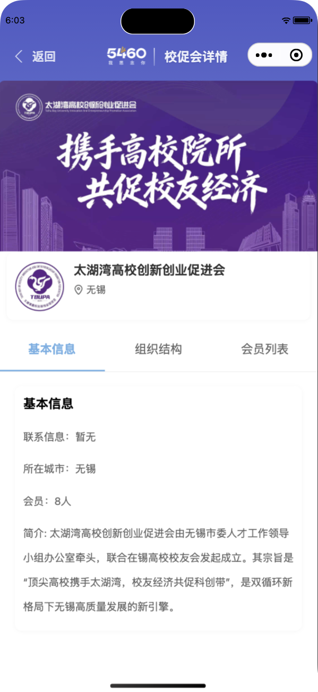
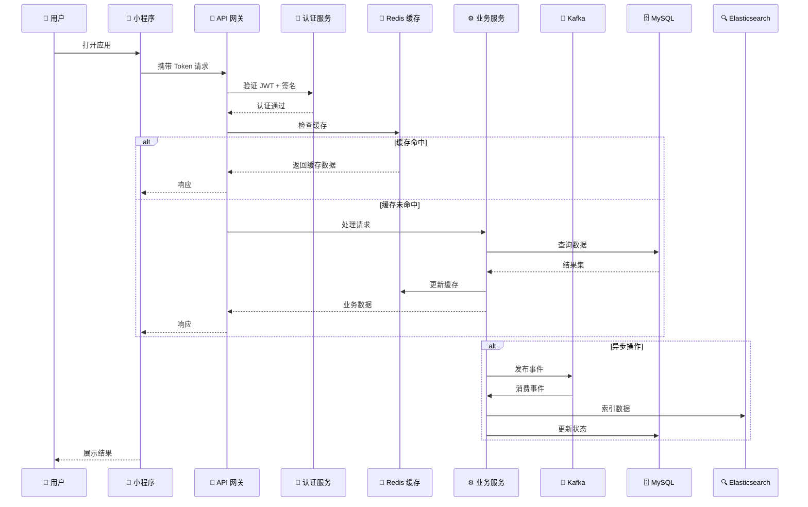
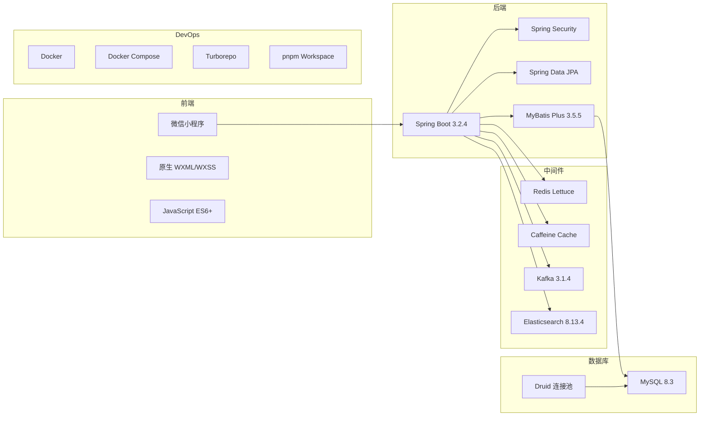
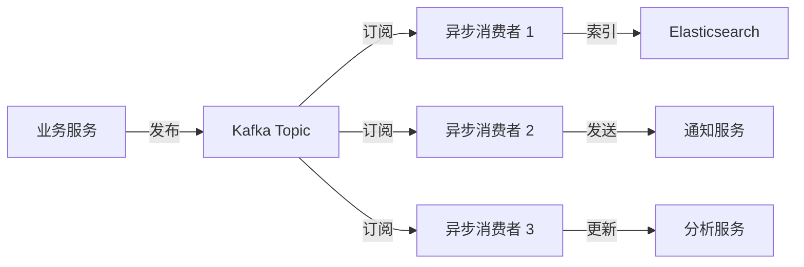

# 🎓 CNI 校友管理系统

<div align="center">

**基于现代化架构的全栈校友管理平台**

[](https://opensource.org/licenses/MIT)
[](https://pnpm.io/)
[](https://turbo.build/repo)
[](https://spring.io/projects/spring-boot)
[](https://openjdk.org/)

[English](README.md) | [简体中文](README_CN.md)

</div>

---

## 📖 项目简介

**CNI 校友管理系统**是一个企业级全栈平台，专为校友会管理而设计，采用微信小程序前端和 Spring Boot 微服务后端架构。本项目展示了现代软件架构模式、Monorepo 管理和可扩展的系统设计。

### 🎯 核心亮点

- 🏗️ **Monorepo 架构** - 使用 pnpm workspaces 和 Turborepo 统一管理代码库
- 🔄 **事件驱动设计** - 基于 Apache Kafka 的异步处理
- 🚀 **高性能缓存** - 多层缓存策略（Redis + Caffeine）
- 🔍 **全文检索** - Elasticsearch 集成实现高级搜索功能
- 🔐 **安全认证** - 基于 JWT 的认证和签名验证
- 📱 **原生小程序** - 微信原生开发（无框架）获得最优性能
- 🐳 **容器化部署** - Docker & Docker Compose 确保环境一致性
- 📊 **实时通信** - WebSocket 支持即时消息

---

## 📸 项目截图

> **说明**：本节展示微信小程序界面和核心功能。

<div align="center">

### 主要功能展示

<table>
  <tr>
    <td align="center" width="33%">
      
      <br>
      <b>🏠 首页</b>
      <br>
      <sub>用户仪表板与快速访问</sub>
    </td>
    <td align="center" width="33%">
      
      <br>
      <b>🎓 校友会</b>
      <br>
      <sub>浏览并加入校友会</sub>
    </td>
    <td align="center" width="33%">
      
      <br>
      <b>📍 同城平台</b>
      <br>
      <sub>区域活动发现</sub>
    </td>
  </tr>
  <tr>
    <td align="center" width="50%">
      
      <br>
      <b>💬 实时聊天</b>
      <br>
      <sub>基于 WebSocket 的消息系统</sub>
    </td>
    <td align="center" width="50%">
      
      <br>
      <b>👤 用户资料</b>
      <br>
      <sub>个人信息管理</sub>
    </td>
  </tr>
</table>

</div>

---

## 🏛️ 系统架构

### 高层架构图

```mermaid
graph TB
    subgraph "前端层"
        A[微信小程序]
        A1[用户界面]
        A2[WebSocket 客户端]
        A3[API 客户端]
    end

    subgraph "API 网关层"
        B[Spring Boot 后端]
        B1[REST 控制器]
        B2[WebSocket 处理器]
        B3[认证过滤器]
        B4[签名验证]
    end

    subgraph "业务逻辑层"
        C1[用户服务]
        C2[校友会服务]
        C3[活动服务]
        C4[消息服务]
        C5[企业服务]
    end

    subgraph "数据访问层"
        D1[MyBatis Plus]
        D2[Repository 层]
        D3[实体模型]
    end

    subgraph "基础设施层"
        E1[(MySQL 数据库)]
        E2[(Redis 缓存)]
        E3[Elasticsearch]
        E4[Apache Kafka]
        E5[文件存储]
    end

    subgraph "外部服务"
        F1[微信 API]
        F2[腾讯地图 API]
        F3[短信服务]
    end

    A1 --> A3
    A2 --> B2
    A3 --> B1
    B1 --> B3
    B3 --> B4
    B4 --> C1
    B4 --> C2
    B4 --> C3
    B4 --> C4
    B4 --> C5

    C1 --> D1
    C2 --> D1
    C3 --> D1
    C4 --> D1
    C5 --> D1

    D1 --> D2
    D2 --> D3
    D3 --> E1

    C1 -.缓存.-> E2
    C2 -.缓存.-> E2
    C3 -.搜索.-> E3
    C4 -.消息队列.-> E4
    C5 -.文件上传.-> E5

    A --> F1
    A --> F2
    B1 --> F3

    style A fill:#1AAD19
    style B fill:#6DB33F
    style E1 fill:#4479A1
    style E2 fill:#DC382D
    style E3 fill:#00BFA5
    style E4 fill:#231F20
```



### 数据流架构



### 技术栈概览



---

## 🗂️ Monorepo 结构

```
5460-alumni/
├── apps/
│   ├── mini-app/                 # 微信小程序（前端）
│   │   ├── api/                  # API 客户端层
│   │   ├── pages/                # 页面组件（28 个模块）
│   │   ├── components/           # 可复用 UI 组件
│   │   ├── utils/                # 工具函数
│   │   │   ├── request.js        # HTTP 客户端（含拦截器）
│   │   │   ├── signature.js      # API 签名验证
│   │   │   ├── socketManager.js  # WebSocket 管理器
│   │   │   └── auth.js           # 认证逻辑
│   │   ├── assets/               # 静态资源
│   │   └── custom-tab-bar/       # 自定义导航栏
│   │
│   └── server-java/              # Spring Boot 后端
│       ├── alumni-main/          # 主应用入口
│       ├── alumni-api/           # API 接口定义
│       │   ├── user-api/         # 用户服务 API
│       │   ├── association-api/  # 校友会服务 API
│       │   └── system-api/       # 系统服务 API
│       ├── alumni-service/       # 业务逻辑实现
│       │   ├── user-service/
│       │   ├── association-service/
│       │   └── system-service/
│       ├── alumni-web/           # Web 控制器
│       ├── alumni-common/        # 通用工具和模型
│       ├── alumni-config/        # 配置管理
│       ├── alumni-auth/          # 认证与授权
│       ├── alumni-aop/           # 面向切面编程
│       ├── alumni-redis/         # Redis 集成
│       ├── alumni-kafka/         # Kafka 集成
│       └── alumni-search/        # Elasticsearch 集成
│
├── packages/                     # 共享包（未来）
│   └── shared-utils/             # 跨项目工具库
│
├── .github/
│   └── workflows/                # CI/CD 流水线
│
├── docker-compose.yml            # 本地开发环境
├── turbo.json                    # Turborepo 配置
├── pnpm-workspace.yaml           # pnpm Workspace 配置
└── package.json                  # 根包配置
```

---

## 🚀 快速开始

### 环境要求

- **Node.js** >= 18.0.0
- **pnpm** >= 8.0.0
- **Java** 17
- **Maven** 3.8+
- **Docker** & **Docker Compose**（可选，用于本地服务）
- **微信开发者工具**（用于小程序开发）

> 💡 **重要提示**：请确保不要提交 `node_modules` 或其他构建产物到代码库。根目录已提供完整的 `.gitignore` 文件以防止意外提交。

### 安装

```bash
# 克隆仓库
git clone https://github.com/yannqing/5460-alumni.git
cd 5460-alumni

# 使用 pnpm 安装依赖
pnpm install
```

### 开发

#### 启动所有服务

```bash
# 并行启动前后端
pnpm dev
```

#### 启动单个服务

```bash
# 仅启动小程序
pnpm dev:mini

# 仅启动 Spring Boot 后端
pnpm dev:java
```

#### 启动基础设施服务（Docker）

```bash
# 进入后端目录
cd apps/server-java

# 启动 MySQL, Redis, Kafka, Elasticsearch
docker-compose -f docker-compose-local.yml up -d
```

### 构建

```bash
# 构建所有项目
pnpm build

# 构建特定项目
pnpm build:mini
pnpm build:java
```

### 测试

```bash
# 运行所有测试
pnpm test

# 监听模式运行测试
pnpm test:watch
```

---

## 🔧 配置

### 环境变量

在根目录创建 `.env` 文件：

```env
# 数据库配置（必需）
DB_HOST=localhost
DB_PORT=3306
DB_NAME=cni_alumni
DB_USERNAME=your_username
DB_PASSWORD=your_password

# Redis 配置（必需）
REDIS_HOST=localhost
REDIS_PORT=6379
REDIS_PASSWORD=

# Kafka 配置（可选 - 如不需要可在 Spring Profile 中禁用）
KAFKA_BOOTSTRAP_SERVERS=localhost:9092

# Elasticsearch 配置（可选 - 如不需要可在 Spring Profile 中禁用）
ES_HOST=localhost
ES_PORT=9200

# 微信配置（小程序必需）
WECHAT_APPID=your_appid
WECHAT_SECRET=your_secret

# 腾讯地图 API（位置功能必需）
QQMAP_KEY=your_map_key
```

> 💡 **快速启动提示**：如果本地没有配置 Elasticsearch 或 Kafka，可以暂时在 `application.yaml` 中注释掉相应的 Spring Boot 自动配置。核心功能（用户、校友会管理）仅需 MySQL 和 Redis 即可运行。

### 后端配置

编辑 `apps/server-java/alumni-main/src/main/resources/application.yaml`：

```yaml
spring:
  profiles:
    active: local  # 可选: local, test, prod
```

---

## 📊 核心功能

### 🔐 认证与授权

- 基于 JWT 的无状态认证
- API 签名验证（时间戳 + 随机数）
- 基于角色的访问控制（RBAC）
- 自动 Token 刷新机制

### 👥 用户管理

- 微信静默登录集成
- 用户资料管理
- 校友会成员身份
- 企业关联

### 🎓 校友会管理

- 创建和管理校友会
- 成员审批工作流
- 组织架构层级
- 活动策划与参与

### 💼 企业名录

- 企业注册与认证
- 校友企业目录
- 职位发布和职业机会
- 商业网络

### 📅 活动管理

- 活动创建与发布
- 报名与签到跟踪
- 实时通知
- 照片画廊与分享

### 💬 消息系统

- 基于 WebSocket 的实时聊天
- 群组对话
- 消息通知
- 文件分享（图片、文档、音频）

### 🔍 高级搜索

- Elasticsearch 支持的全文搜索
- 模糊匹配和相关性评分
- 多字段聚合
- 搜索结果高亮

---

## 🏗️ 架构亮点

### 分层架构

```
┌─────────────────────────────────────┐
│      表现层                          │  控制器、DTO、验证
├─────────────────────────────────────┤
│      业务逻辑层                      │  服务、领域模型
├─────────────────────────────────────┤
│      数据访问层                      │  Repository、ORM
├─────────────────────────────────────┤
│      基础设施层                      │  缓存、消息队列、搜索、存储
└─────────────────────────────────────┘
```

### 使用的设计模式

- **Repository 模式** - 数据访问抽象
- **Service 层模式** - 业务逻辑封装
- **DTO 模式** - 数据传输优化
- **Strategy 模式** - 支付和通知策略
- **Observer 模式** - Kafka 事件驱动消息
- **Singleton 模式** - 配置管理
- **Factory 模式** - 服务创建

### 缓存策略

```
┌─────────────┐
│ 请求        │
└──────┬──────┘
       │
       ▼
┌─────────────────────┐
│ L1: Caffeine 缓存   │  (本地，内存)
│ TTL: 5 分钟         │
└──────┬──────────────┘
       │ 缓存未命中
       ▼
┌─────────────────────┐
│ L2: Redis 缓存      │  (分布式)
│ TTL: 1 小时         │
└──────┬──────────────┘
       │ 缓存未命中
       ▼
┌─────────────────────┐
│ MySQL 数据库        │  (持久化)
└─────────────────────┘
```

### 事件驱动架构



---

## 🛠️ 技术深度解析

### 前端架构

**微信小程序原生开发**

- **为什么选择原生？** 最佳性能、官方 API 支持、更小的包体积
- **状态管理** - 本地存储 + 事件总线模式
- **网络层** - 集中式请求拦截器，带重试逻辑
- **组件复用性** - 自定义组件确保 UI 一致性

**关键技术：**

- **API 签名** - 防止重放攻击和篡改
- **WebSocket** - 实时消息，带自动重连
- **图片优化** - 懒加载和压缩
- **请求去重** - 防止并发重复请求

### 后端架构

**Spring Boot 微服务设计**

- **Maven 多模块** - 清晰的关注点分离
- **Spring Security** - JWT 认证和自定义过滤器
- **MyBatis Plus** - 增强的 ORM，带自动填充和分页
- **Druid** - 连接池，带 SQL 监控

**关键技术：**

- **分布式事务** - Kafka 实现最终一致性
  - **消息幂等性**：每条 Kafka 消息包含唯一 `messageId`，防止重复处理
  - **最终一致性**：订单创建 → 库存扣减 → 通知发送采用异步处理
  - **补偿机制**：失败消息采用指数退避重试，超过最大次数后触发人工补偿
  - **数据一致性**：使用 Saga 模式协调分布式事务
- **API 幂等性** - 基于 Token 的幂等设计
- **限流** - Redis + Lua 脚本实现分布式限流
- **异步处理** - @Async 注解配合自定义线程池

### 数据库设计

**MySQL 架构亮点：**

- **逻辑删除** - `is_delete` 标志实现软删除
- **乐观锁** - Version 字段处理并发更新
- **审计字段** - `created_time`、`updated_time`、`creator`、`updater`
- **索引优化** - 针对常见查询的复合索引

**示例实体：**

```java
@Data
@TableName("user")
public class User {
    @TableId(type = IdType.AUTO)
    private Long id;

    private String username;
    private String nickname;
    private String avatar;

    @TableField(fill = FieldFill.INSERT)
    private LocalDateTime createdTime;

    @TableField(fill = FieldFill.INSERT_UPDATE)
    private LocalDateTime updatedTime;

    @Version
    private Integer version;

    @TableLogic
    private Integer isDelete;
}
```

### 搜索架构

**Elasticsearch 集成：**

- **索引设计** - 用户、活动、企业分别独立索引
- **映射配置** - IK 分词器用于中文文本分词
- **搜索功能** - 模糊搜索、短语匹配、权重提升
- **聚合** - 分面搜索和统计

---

## 📦 部署

### Docker 部署

```bash
# 构建 Docker 镜像
cd apps/server-java
docker build -t cni-alumni:latest .

# 运行容器
docker run -d \
  -p 8080:8080 \
  -e SPRING_PROFILES_ACTIVE=prod \
  -e DB_HOST=your-db-host \
  -e DB_PASSWORD=your-password \
  --name cni-alumni \
  cni-alumni:latest
```

### Docker Compose 部署

```bash
# 生产环境部署
docker-compose up -d
```

### 环境特定配置文件

```yaml
# application.yaml
spring:
  profiles:
    active: ${SPRING_PROFILES_ACTIVE:local}

---
# application-local.yaml (开发环境)
spring:
  config:
    activate:
      on-profile: local

---
# application-prod.yaml (生产环境)
spring:
  config:
    activate:
      on-profile: prod
```

---

## 👥 团队与协作

### 项目结构

- **项目负责人** - 整体架构和项目管理
- **前端团队** - 微信小程序开发
- **后端团队** - Spring Boot 微服务
- **DevOps 团队** - CI/CD 和基础设施

### 贡献者

<a href="https://github.com/yannqing/5460-alumni/graphs/contributors">
  
</a>

**核心团队成员：**
- **yannqing** - 项目负责人 & 全栈架构师
  - 🏗️ 整体架构设计和系统规划
  - 💻 Spring Boot 微服务后端开发
  - 🚀 DevOps 和基础设施自动化
  - ✅ 自动化指标：通过 GitHub Actions 实时追踪项目贡献
  - ✅ CI/CD 流水线：自动化测试和部署工作流
  - ✅ 基础设施即代码：Docker & Docker Compose 编排
- **cheny** - 前端开发
  - 📱 微信小程序开发
  - 🎨 UI/UX 实现
- **lili** - 前端开发
  - 📱 微信小程序开发
  - 🔧 组件架构

---

## 📈 性能优化

### 后端优化

- **连接池** - Druid 优化池大小
- **SQL 优化** - 索引调优和查询优化
- **缓存预热** - 预加载频繁访问的数据
- **异步处理** - 重操作使用非阻塞 I/O
- **批量操作** - 批量插入/更新大数据

### 前端优化

- **代码分割** - 大型应用的分包加载
- **图片优化** - WebP 格式带降级
- **请求合并** - 合并多个 API 调用
- **本地缓存** - Storage API 实现离线能力
- **懒加载** - 按需加载组件

---

## 🧪 测试策略

### 后端测试

```bash
# 单元测试
mvn test

# 集成测试
mvn verify

# 测试覆盖率报告
mvn jacoco:report
```

**覆盖率目标：**
- 单元测试: >70%
- 集成测试: >50%
- 核心业务逻辑: >90%

### 前端测试

```bash
# 单元测试（未来）
pnpm test:mini

# E2E 测试（未来）
pnpm test:e2e
```

---

## 📚 API 文档

### Swagger UI

访问 API 文档：`http://localhost:8080/doc.html`

**Knife4j 功能：**
- 交互式 API 测试
- 请求/响应示例
- 模型架构可视化
- 授权支持

### API 端点示例

```http
POST /api/v1/user/login
Content-Type: application/json

{
  "code": "微信登录码",
  "timestamp": 1234567890,
  "signature": "计算的签名"
}
```

**响应：**

```json
{
  "code": 200,
  "message": "成功",
  "data": {
    "token": "eyJhbGciOiJIUzI1NiIsInR5cCI6IkpXVCJ9...",
    "userInfo": {
      "id": 1,
      "username": "alumni001",
      "nickname": "张三",
      "avatar": "https://..."
    }
  }
}
```

---

## 🔒 安全最佳实践

### 已实施的安全措施

- ✅ **JWT 认证** - 基于 Token 的无状态认证
- ✅ **API 签名验证** - 防止重放攻击
- ✅ **SQL 注入防护** - MyBatis 参数化查询
- ✅ **XSS 防护** - 输入净化和输出编码
- ✅ **仅 HTTPS** - 加密通信
- ✅ **CORS 配置** - 基于白名单的源控制
- ✅ **限流** - 防止暴力破解攻击
- ✅ **敏感数据加密** - PII 使用 AES 加密

### 安全检查清单

- [ ] 定期依赖更新
- [ ] 安全审计日志
- [ ] 渗透测试
- [ ] OWASP Top 10 合规
- [ ] 数据备份和恢复计划

---

## 📝 贡献

我们欢迎贡献！详情请参阅 [CONTRIBUTING.md](CONTRIBUTING.md)。

### 开发工作流

1. **Fork** 仓库
2. **创建** 功能分支 (`git checkout -b feature/amazing-feature`)
3. **提交** 更改 (`git commit -m 'feat: 添加惊艳功能'`)
4. **推送** 到分支 (`git push origin feature/amazing-feature`)
5. **打开** Pull Request

### 提交信息规范

遵循 [Conventional Commits](https://www.conventionalcommits.org/)：

```
feat: 添加用户资料页面
fix: 解决 token 过期问题
docs: 更新 API 文档
style: 使用 prettier 格式化代码
refactor: 重构服务层
test: 为认证服务添加单元测试
chore: 更新依赖
```

---

## 📄 许可证

本项目采用 MIT 许可证 - 详见 [LICENSE](LICENSE) 文件。

---

## 🙏 致谢

- [Spring Boot](https://spring.io/projects/spring-boot) - 后端框架
- [MyBatis Plus](https://baomidou.com/) - 增强的 MyBatis 框架
- [Turborepo](https://turbo.build/repo) - Monorepo 构建系统
- [微信开放平台](https://developers.weixin.qq.com/miniprogram/dev/framework/) - 小程序开发

---

## 📞 联系方式

- **项目负责人** - [@yannqing](https://github.com/yannqing)
- **X (Twitter)** - [@yan_qing02](https://x.com/yan_qing02)
- **邮箱** - yannqing020803@gmail.com
- **项目链接** - [https://github.com/yannqing/5460-alumni](https://github.com/yannqing/5460-alumni)

---

## 🗺️ 路线图

### 阶段 1 - 基础（已完成 ✅）
- [x] 使用 pnpm + Turborepo 设置 Monorepo
- [x] 微信小程序认证
- [x] Spring Boot 后端基础
- [x] 数据库设计和实现
- [x] Redis 缓存层
- [x] Kafka 消息队列集成

### 阶段 2 - 核心功能（进行中 🚧）
- [x] 用户管理
- [x] 校友会管理
- [x] 活动管理
- [ ] 支付集成
- [ ] Elasticsearch 高级搜索

### 阶段 3 - 增强（已计划 📋）
- [ ] AI 驱动的推荐
- [ ] 数据分析仪表板
- [ ] 移动应用（React Native）
- [ ] 国际化（i18n）
- [ ] 微服务拆分

### 阶段 4 - 规模化（未来 🚀）
- [ ] Kubernetes 部署
- [ ] 服务网格（Istio）
- [ ] 分布式追踪（Zipkin）
- [ ] 多区域部署
- [ ] 99.99% SLA

---

<div align="center">

**由 CNI 校友团队用 ❤️ 构建**

⭐ 如果觉得有帮助，请为本仓库加星！

</div>
