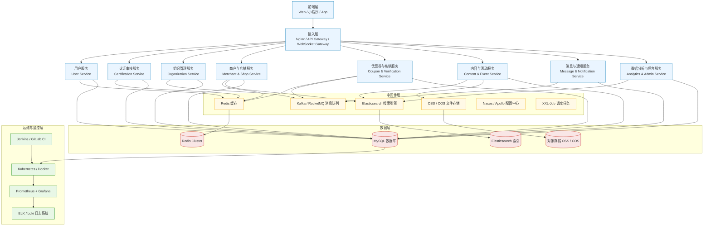
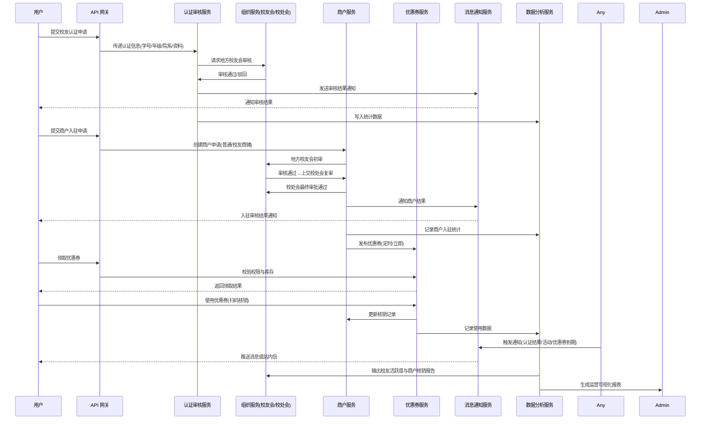
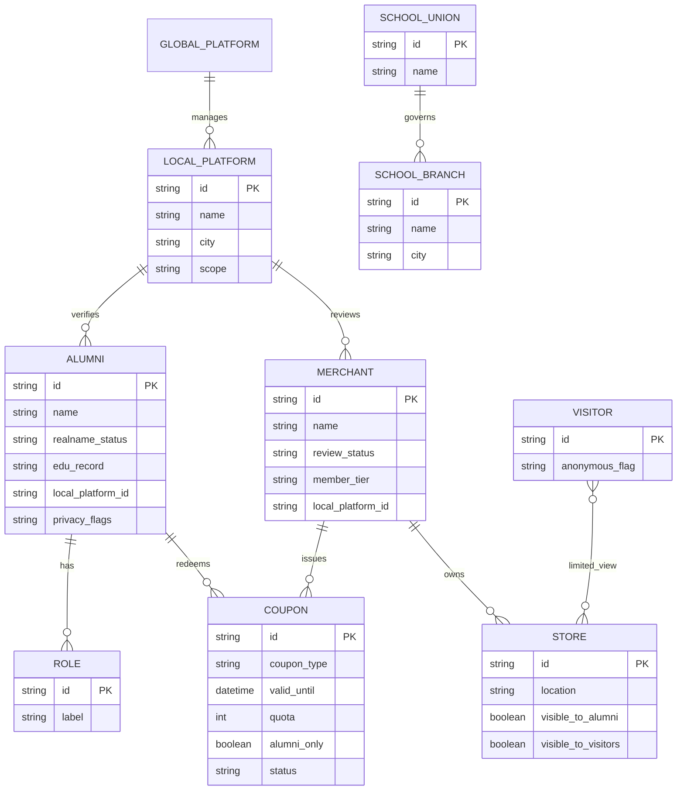

# 中国校友平台 产品需求文档

## 1. 项目概述

### 1.1 项目背景
校处会下有100+校友会，引入商户到平台，参考90年代的"我思念你"（5460项目，中国同学录）校友平台。

### 1.2 业务模式
- **垂直业务模式**，逐步往下推进
- **前期版本核心**：突出官方认证

### 1.3 核心业务闭环
**"注册-认证-找店/找人-领券-核销"**

## 2. 用户与角色体系

### 2.1 用户角色分类

#### 2.1.1 普通用户
- **游客**：未经任何认证的用户
- **校友**：经过校友会认证的用户

#### 2.1.2 组织角色
- **校友总平台**：全国统一管理平台（1个）
- **地方校处会**：地区管理机构（多个，暂以无锡为主）
- **学校校友总会**：学校层级管理（待定）
- **学校地方校友会**：学校在各地的分会
- **商户**：入驻平台的商业主体

#### 2.1.3 校友特征
- 必须经过地方校友会认证
- 可能拥有多重身份（如：天一中学毕业生+天津大学本科毕业生+瑞幸咖啡店长）

#### 2.1.4 商户分类
- **校友商铺**：由校友经营，功能更强大完善
- **普通商铺**：一般商户，功能有限制
- **入驻要求**：校友商户需校友会审核，普通商户需校处会审核
- **运营限制**：普通商户发布优惠券有限制，需缴费升级

## 3. 权限与管理架构

### 3.1 地方校处会管理权限

#### 3.1.1 管理岗位
| 角色 | 校友认证 | 商户管理 | 用户管理 | 数据查看 | 系统设置 |
|------|----------|----------|----------|----------|----------|
| 超级管理员 | ✓ | ✓ | ✓ | ✓ | ✓ |
| 校友认证管理员 | ✓ | ✗ | 部分 | 部分 | ✗ |
| 商户管理专员 | ✗ | ✓ | 部分 | 部分 | ✗ |
| 内容审核专员 | ✗ | ✗ | 部分 | 部分 | ✗ |
| 数据分析师 | ✗ | ✗ | ✗ | ✓ | ✗ |

#### 3.1.2 具体职能
**校友认证管理**：
- 审核校友申请认证
- 验证校友身份真实性
- 处理认证申诉、复核
- 管理校友认证状态
- 导入、导出数据

**商户管理**：
- 审核普通商户入驻申请
- 管理商户等级与会费
- 监控处理商户违规情况
- 监控优惠券发布情况

**内容审核管理**：
- 审核校友发布的圈子内容
- 监控商户发布的话题和活动
- 处理用户举报的不当内容
- 维护平台内容质量

**数据分析**：
- 分析校友活跃度和分布
- 统计商户经营数据
- 生成地方校友会运营报告
- 提供数据支持给决策层

### 3.2 地方校友会权限
**会长职能**：全面管理地方校友会

**内容管理**：
- 日常运营（母校相关信息更新、内容公告发布）
- 活动组织，发起活动、处理报名与通知
- 地方校友会活动、公告等信息发布

**认证审核**：
- 校友认证审核（涉及母校认证，必要时线下核实）
- 校友商铺审核
- 校友企业审核

### 3.3 商户权限层级
**总店长**：管理商铺最高权限
- 新建门店
- 分店长管理

**秘书长/总管理员**：
- 优惠券发布
- 全部门店活动举办

**分店长**：
- 管理整个门店
- 分店店员管理

**分店店员/管理员**：
- 负责该分店职务（话题发布、活动举办、优惠券核销）

## 4. 核心功能模块

### 4.1 校友功能

#### 4.1.1 校友认证
**认证流程**：
1. **母校认证**：实名认证（人脸识别）+ 在校经历认证
2. **地方校友认证**：地方校友会审核（可选）

**认证逻辑**：母校认证通过后，地方认证相对简单

#### 4.1.2 圈子功能
- 相当于不需审核的校友会
- 非官方校友自建交流频道

#### 4.1.3 找人功能
**查找方式**：
- **精确查找**：
  - 学校-年级-院系/学部-专业/班级-具体姓名（必须全部输入）
  - 手机号查找
  - 邮箱查找（待定）
- **校友会查找**：
  - 年级-院系/学部-专业/班级-具体姓名（模糊查询）
- **消费记录查找**：
  - 点击店铺-活跃记录
- **活动记录查找**：
  - 店铺话题参与者
  - 校友会活动参与者

**隐私保护**：
- 所有用户隐私默认关闭，需在设置中开启
- 仅能搜索已认证校友
- 可选择隐藏在找校友中被发现

#### 4.1.4 邀请认证功能
- 二维码/邀请码/微信链接邀请
- 记录邀请关系
- 邀请数量达标可获得奖励（待定）

#### 4.1.5 组织查看
- **母校列表**：基本信息、下属校友会、学校活动
- **校友会列表**：查看所属的所有校友会

### 4.2 商户功能

#### 4.2.1 商户入驻
基本入驻流程和审核机制

#### 4.2.2 发现功能
**个性化推荐**：
- 不对游客开放
- 根据位置距离推荐
- 仅展示有优惠券的门店

#### 4.2.3 优惠券管理
**类型**：折扣券、满减券、礼品券

#### 4.2.4 会员等级管理
缴纳会费，享受不同权益（优惠券限制、场所限制）

### 4.3 找店功能

#### 4.3.1 游客视图
- 基础地图视角与列表查看
- 展示有优惠券的门店
- 校友专属店铺会提示：认证成为校友后可享受更多权益
- 附近30km内门店数量展示
- 分类查看（餐饮、酒店等）
- 排序：距离优先、好评优先、优惠力度、核销数量

#### 4.3.2 校友视图
- **分类检索**：校友专属店铺、按校友会检索
- **列表视图**：门店卡片有"校友商铺"专属标识
- **地图视角**：区分校友门店和非校友门店
- **个性化推荐**：
  - 猜你喜欢（基于消费记录、同校友会偏好）
  - 同学常去（校友会校友常去商铺）
  - 消息互动（XX校友刚刚领券、您的校友XX也来过）
- **搜索功能**：
  - 店铺名称或关键字搜索
  - "找校友老板"：根据校友名字搜索其名下门店

#### 4.3.3 商铺后台
- **曝光数据**：展示、点击、领券数量
- **点击排行榜**：基于50km或整个城市的排名
- **竞争分析**（VIP3及以上）：
  - 周边同类商铺优惠券力度
  - 周边店铺客流热度分析
- **付费推广**：
  - 校友/校友会页面广告位
  - 地图视角标红商铺
  - 列表优先推荐
  - 扩大曝光范围

#### 4.3.4 地方校友会视图
- **专属地图**：仅高亮本会认证的校友店铺
- **数据统计**：商铺数量、优惠券价值、总核销数
- **推荐功能**：优秀商铺展示"校友会推荐"标签

#### 4.3.5 地方校处会视图
- **全局视图**：
  - 全城商铺热力分布图
  - 按区域、行业筛选饱和度
  - 每日优惠券核销总数、核销率
- **规则配置**：
  - 商铺会员等级价格和档位设置
  - 曝光规则管理（不同会员等级的曝光次数上限）
  - 付费推广价格和档位设置
- **商铺监控**：
  - 审核"校友会推荐"标签
  - 管理长期无优惠券、差评过多的店铺

### 4.4 优惠券系统

#### 4.4.1 领券功能
- 校友领券后可选择立即使用或稍后使用
- 显示"您是今日第X位领券校友"
- 个人中心"我的券包"：未使用、已使用、已过期
- 优惠券状态提醒（即将过期、附近可用门店）

#### 4.4.2 发布管理
- 定时发布（规定时间发布）或立即发布
- 多入口曝光（首页、商铺详情页、附近商铺列表、活动页等）
- 优惠券分类：折扣券、满减券、礼品券
- 安全限制：防刷（限购数量）、并发控制

#### 4.4.3 核销功能
- **核销方式**：扫码、输入卡号
- **记录管理**：核销人信息、用户信息留存
- **风险控制**：防重复核销、有效期检测
- **权限管理**：店员拥有核销权限

## 5. 组织架构展示

### 5.1 母校主页
- 图标、名称
- 校友总会认证标识（可设置）
- 合并院校、曾用名
- 本部所在地
- 包含校友会
- 排序方式：关注数、校友会数量
- 信息来源：预设、校友提交反馈

### 5.2 校友会主页
- 上级校处会认证（名称+专属认证标识）
- 图标（采用母校图标）
- 归属母校名称
- 校友成员（会长、副会长、管理员）
- 基本信息（联系人、常驻地点）
- 同校的其他校友会列表
- 功能模块：活动、公告、校友企业、校友商户、社区、关注系统

### 5.3 校友主页
- 个人信息（可选展示）
- 认证标识
- 母校信息（可能多个）
- 加入的校友会

## 6. 技术架构

### 6.1 系统架构图


### 6.2 业务流程图

#### 6.2.1 校友认证与商户入驻流程


#### 6.2.2 商户入驻与优惠券发布流程
```mermaid
flowchart TB
  A[商户提交入驻申请] --> B[地方校友平台审核]
  B -->|通过| C[成为已入驻商户]
  B -->|驳回| B1[反馈原因/补充材料]

  C --> D{会员等级?}
  D -->|普通| E[发布优惠券数量/功能受限]
  D -->|付费升级| F[提升限额与权益]

  E --> G[发布优惠券]
  F --> G

  G --> H{店铺是否有"上架中且可领取"的优惠券?}
  H -- 否 --> H1[不进入"附近校友商铺"列表]
  H -- 是 --> I[进入"附近校友商铺"]
  I --> J[个性化推荐]
  J --> K[已认证校友可领取并使用]
  K --> L[核销与数据沉淀]
```

#### 6.2.3 校友邀请流程
```mermaid
flowchart LR
  A[用户A发起邀请] --> B[二维码/邀请码/微信链接]
  B --> C[用户B通过链接进入]
  C --> D[走校友认证流程]
  D -->|通过| E[记录A邀请B成功]
  D -->|未通过/未完成| F[待跟进/不计入]

  E --> G{A的成功邀请数达阈值?}
  G -- 否 --> H[累计记分]
  G -- 是 --> I[发放礼品/奖金(待定规则)]
```

#### 6.2.4 找人功能流程
```mermaid
flowchart TB
  A[进入"找人"] --> B{是否已认证校友?}
  B -- 否 --> B1[不可搜索; 引导去认证]
  B -- 是 --> C[输入条件: 学校/年份/姓名/学号...]
  C --> D[可选过滤: 活动记录、商铺互动(若本人开启公开)]
  D --> E[仅检索"已认证校友"索引]
  E --> F[结果=校友名片 + 可公开信息]
  F --> G[查看活动记录(若对方公开)]
  F --> H[尊重对方隐私设置(默认关闭)]
```

### 6.3 数据模型


## 7. 待解决问题

### 7.1 认证机制
- 校友申请认证：人工审核 vs 人工+自动？如果自动化，是否需要同步学校数据？
- 学校组织信息是否由地方校友会维护？
- 是否引入非官方校友会组织？
- 申请校友卡时，是否自动加入对应校友会？

### 7.2 管理权限
- 校友商铺审核：地方校友会负责，但会费管理归校处会还是校友会？

### 7.3 功能规划
- 圈子功能：第二期开发
- 关注系统、私信功能：待定
- 消息通知系统：具体实现方案待定

## 8. 第一版开发重点

### 8.1 必须完成的功能
1. **认证审核流程**：校友认证、校处会预设、地方校友会预设、校友总会预设、商铺入驻审核、校友企业申请审核
2. **角色权限确定**：各角色权限矩阵明确
3. **找校友功能**：精确查找、隐私保护
4. **找店功能**：游客和校友的不同视图
5. **优惠券系统**：领券、核销完整流程
6. **组织架构展示**：母校、校友会、校友主页

### 8.2 暂缓功能
- 圈子（社区功能）
- 关注系统
- 私信功能
- 群聊功能

---

*文档版本：v1.0*  
*更新时间：2024-11-05*